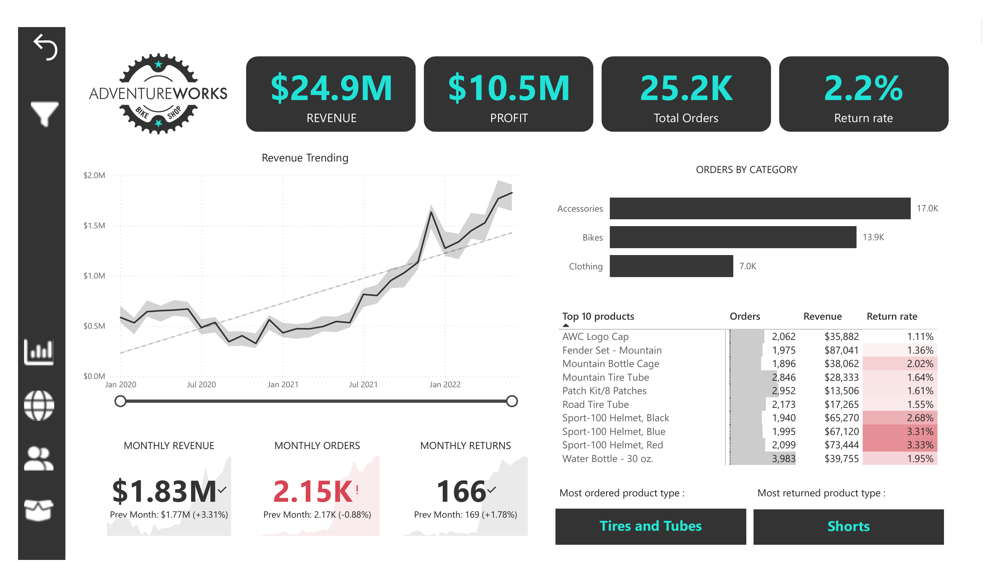
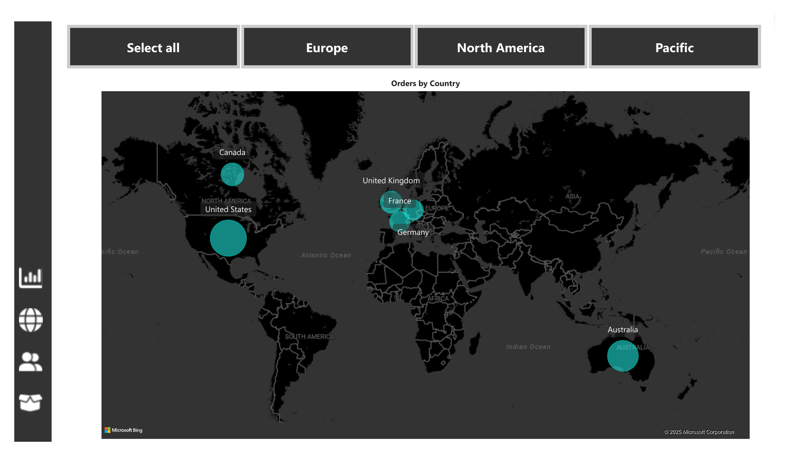
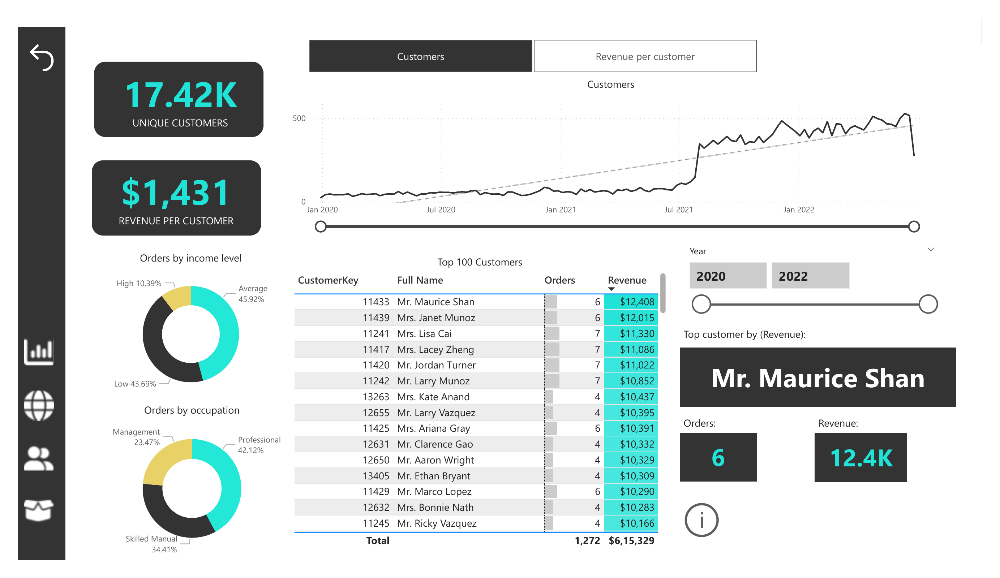
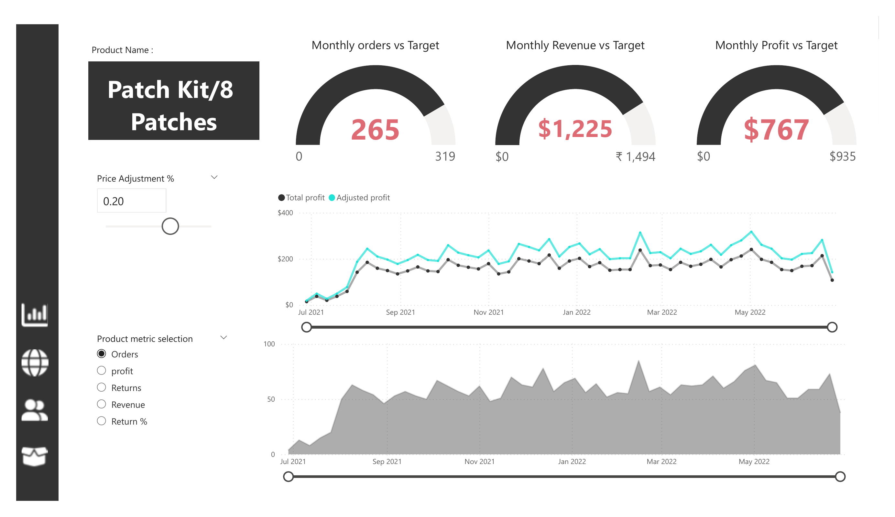

# Adventure Works Sales Analysis

This repository contains a Power BI dashboard and a PDF report that analyze sales performance, customer behavior, and product metrics for the Adventure Works company. The report offers deep insights into revenue trends, customer demographics, product returns, and geography-based performance.

---

## 📘 Introduction

This project explores a sales dataset from Adventure Works, providing a comprehensive view of business performance through key performance indicators (KPIs) such as revenue, profit, orders, returns, and customer segmentation. It supports data-driven decision-making for sales optimization and customer engagement.

---

## 🛠️ Background

Adventure Works, a global cycling and outdoor gear brand, seeks to better understand its sales performance and customer behavior. This analysis is built using Power BI and covers over $24 million in revenue, more than 25,000 orders, and customer interactions across multiple geographies and income groups.

---

## 🧰 Tools Used

- **Power BI** – For building interactive dashboards and conducting visual analysis  
- **Microsoft Excel** – For preprocessing and cleaning source data  
- **PDF** – To export a report snapshot for presentation or offline viewing

---

## 📊 Key Metrics

- **Total Revenue:** $24.9M  
- **Total Orders:** 25.2K  
- **Total Profit:** $10.5M  
- **Return Rate:** 2.2%  
- **Unique Customers:** 17.42K  
- **Revenue per Customer:** $1,431

---

## 📷 Page 1 – Executive Overview (KPIs & Trends)

This is the landing page of the dashboard with an overview of key performance indicators, revenue trends over time, and a breakdown of orders and returns.

> 💡 From this page, you can **drill through to product details** by right-clicking on any product in the "Top 10 Products" table and selecting the **Drill through → Product Details** option.

---

## 🌍 Geography Overview

This section visualizes **orders by country**, segmented by regions such as North America, Europe, and Pacific.

Key Markets:
- United States  
- Australia  
- Canada  
- United Kingdom  
- France  
- Germany

Use this view to evaluate country-level performance and assess regional trends.

---

## 👥 Customer Insights

This page provides details on customer segmentation by **income level, occupation**, and highlights the **Top 100 customers by revenue**.

### Key Highlights:
- **By Income Level:**  
  - Low: 45.92%  
  - High: 43.69%  
  - Average: 10.39%

- **By Occupation:**  
  - Professional: 42.12%  
  - Skilled Manual: 34.41%  
  - Management: 23.47%

- **Top Customers:**  
  - Mr. Maurice Shan – $12.4K (6 orders)  
  - Mrs. Janet Munoz – $12K (6 orders)

This page helps target high-value customers and understand their behavior.

---

## 📦 Product Details & Drill-through View

This page is accessible via **drill-through** from the main report. It provides detailed analysis on selected products including:

- Revenue
- Profit
- Orders
- Return %
- Price Adjustments

### Key Highlights:
- Top ordered products: **Water Bottle - 30 oz**, **Patch Kit**, **Mountain Tire Tube**
- Highest return rate: **Sport-100 Helmet, Red – 3.33%**
- Majority of revenue comes from **bikes** (road, mountain, touring)

> 🔍 **Drill-Through Navigation:** From the main page, right-click on a product → Drill through → *Product Details* to explore its metrics in-depth.

---

## 📚 Summary of Learnings

- **Bikes** generate the bulk of company revenue, especially road and mountain categories.
- **Accessories** like water bottles and patch kits sell in high volume with low return rates.
- **Customer base** is dominated by professionals and low-income groups.
- High-value customers and high-return products can be monitored more closely using the drill-through pages.

---

## 📁 Files Included

- [`Adventure Work Report.pbix`](Adventure%20Work%20Report.pbix) — Interactive Power BI dashboard  
- [`Adventure Work Report.pdf`](Adventure%20Work%20Report.pdf) — Static report with visuals and KPIs  

---

## 🚀 How to Use

1. Download and install [Power BI Desktop](https://powerbi.microsoft.com/desktop/).
2. Open `Adventure Work Report.pbix` to explore the interactive dashboard.
3. Review the `Adventure Work Report.pdf` for a summarized and shareable version.
4. Use **drill-through** to access deeper insights from summary pages.

---

## 📝 License

This project is intended for educational, analytical, and demonstration purposes only.
